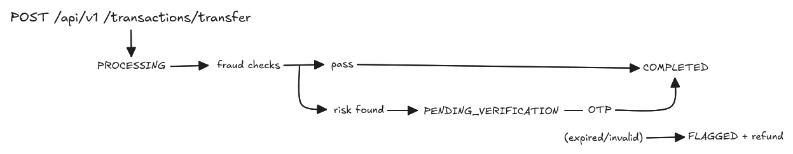
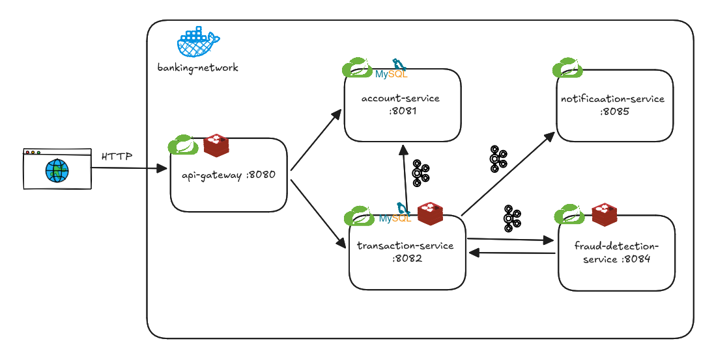

# Banking System

Event-driven banking platform built as a set of Spring Boot microservices. It supports
account creation, balance management and money transfers with **asynchronous fraud
detection**, **OTP verification** and **event-based notifications**, all orchestrated
through Apache Kafka.



## Tech stack

| Layer | Technology |
|---|---|
| Language / build | Java 25, Maven (multi-module) |
| Framework | Spring Boot 4.1.1, Spring Cloud 2025.1.3 |
| API entry | Spring Cloud Gateway + Redis rate limiting |
| Messaging | Apache Kafka (KRaft, single broker), Spring Kafka, OpenFeign for sync calls |
| Persistence | Spring Data JPA (MySQL 8), Redis (OTP + rate limiting + fraud counters) |
| Misc | Lombok, Docker Compose |

## Services

| Module | Port | Responsibility | Datastore |
|---|---|---|---|
| `api-gateway` | 8080 | Single public entry point, routes `/api/v1/accounts/**` → 8081 and `/api/v1/transactions/**` → 8082, per-IP rate limiting | Redis |
| `account-service` | 8081 | Accounts CRUD, balance operations (deduct/credit/block), reacts to transaction events | MySQL `account_db` |
| `transaction-service` | 8082 | Transfers, transaction state machine, OTP issue/verify, compensation (refunds) | MySQL `transaction_db`, Redis |
| `fraud-detection-service` | 8084 | Consumes initiated transfers, runs fraud rules, decides pass / verification required | Redis |
| `notification-service` | 8085 | Kafka consumer that renders OTP / completion / refund / fraud notifications (currently simulated via logs) | — |

> `8083` is intentionally unused. There is **no service discovery**: the Feign client URLs
> are configured per service in each `application.yaml`.

## Architecture



### Transfer flow

1. `POST /api/v1/transactions/transfer` → transaction-service deducts the sender's balance
   (sync Feign call), stores the transaction as `PROCESSING` and publishes
   `transaction.initiated`. The HTTP response returns immediately with `201 PROCESSING`.
2. **fraud-detection-service** consumes the event and runs its rules:
   - *Velocity*: more than 5 transfers per 60s for the account (Redis counter) → risk.
   - *Suspicious amount*: amount greater than 5× the account's average transaction → risk.
   - *Balance exposure*: amount greater than 90% of the account balance → risk.
   - No rules triggered → `fraud.check.passed`.
   - Any rule triggered → `verification.required` (with the failing reason).
3. On `fraud.check.passed`, transaction-service marks the transaction `COMPLETED` and
   publishes `transaction.completed`; **account-service** consumes it and credits the
   receiver's balance.
4. On `verification.required`, transaction-service generates a 6-digit OTP, stores it in
   Redis for **5 minutes**, moves the transaction to `PENDING_VERIFICATION` and publishes
   `transaction.otp.generated` (notification-service logs it — that is how you read the OTP).
   The client then calls `POST /api/v1/transactions/{id}/verify-otp?otp=...`:
   - correct OTP → `COMPLETED`;
   - expired OTP → compensation: refund to sender, status `FLAGGED`, event `transaction.refunded`;
   - invalid OTP → same compensation **plus** `fraud.detected`, which makes account-service
     block the sender's account.

### Kafka topics

| Topic | Producer | Consumers |
|---|---|---|
| `transaction.initiated` | transaction-service | fraud-detection-service |
| `fraud.check.passed` | fraud-detection-service | transaction-service |
| `verification.required` | fraud-detection-service | transaction-service |
| `transaction.otp.generated` | transaction-service | notification-service |
| `transaction.completed` | transaction-service | account-service, notification-service |
| `transaction.refunded` | transaction-service | notification-service |
| `fraud.detected` | transaction-service | account-service, notification-service |

Consumers deserialize events into `Map<String, Object>`; producer field names are the only
contract (there is no shared event module).

## Getting started

### Prerequisites

- **JDK 25** (the build fails on older JDKs — `release version 25 not supported`)
- Maven (system `mvn` ≥ 3.9, or the wrapper bundled in each module)
- Docker + Docker Compose

### 1. Start the infrastructure

```bash
docker compose up -d
```

Brings up MySQL 8 (`root`/`root`, 3306), Redis (6379) and Kafka KRaft (9092).
The MySQL schemas (`account_db`, `transaction_db`) and tables are created automatically
(JPA `ddl-auto: update`; there are no migrations).

### 2. Build and test

```bash
mvn test              # from the repo root — builds all modules
mvn -pl account-service test   # single module
```

> The tests are `@SpringBootTest` context tests, so MySQL must be running.

### 3. Run the services

Start each module's main class from your IDE (in any order), or from the CLI:

```bash
mvn -pl api-gateway spring-boot:run
mvn -pl account-service spring-boot:run
mvn -pl transaction-service spring-boot:run
mvn -pl fraud-detection-service spring-boot:run
mvn -pl notification-service spring-boot:run
```

### 4. Smoke test

Use [`api-requests/requests.http`](api-requests/requests.http) (IntelliJ HTTP client)
against the gateway at `http://localhost:8080`. It runs the full flow:
create sender + receiver accounts → check balance → transfer → read OTP from the
notification-service logs → verify OTP → fetch the transaction.

Quick equivalent with curl:

```bash
# create sender account
curl -s -X POST http://localhost:8080/api/v1/accounts -H "Content-Type: application/json" \
  -d '{"accountOwnerName":"Sender","email":"sender@testmail.com","phone":"0997878787",
       "accountType":"SAVINGS","initialDeposit":10000}'

# transfer
curl -s -X POST http://localhost:8080/api/v1/transactions/transfer -H "Content-Type: application/json" \
  -d '{"senderAccountNumber":"<SENDER>","receiverAccountNumber":"<RECEIVER>",
       "amount":555,"description":"demo"}'

# poll the transaction (id from the previous response)
curl -s http://localhost:8080/api/v1/transactions/<TRANSACTION_ID>
```

If fraud verification was requested, grab the OTP from the notification-service console
and confirm it:

```bash
curl -s -X POST "http://localhost:8080/api/v1/transactions/<TRANSACTION_ID>/verify-otp?otp=108867"
```

## API reference

All endpoints are exposed through the gateway (`http://localhost:8080`).

### Accounts

| Method | Path | Description |
|---|---|---|
| `POST` | `/api/v1/accounts` | Create account (`SAVINGS`, `CURRENT`, `FIXED_DEPOSIT`) with initial deposit |
| `GET` | `/api/v1/accounts/{accountNumber}` | Fetch account details |
| `GET` | `/api/v1/accounts/{accountNumber}/balance` | Current balance |
| `PUT` | `/api/v1/accounts/{accountNumber}/block` | Block account (`ACTIVE` → `BLOCKED`) |
| `PUT` | `/api/v1/accounts/{accountNumber}/deduct?amount=` | Debit balance *(internal, used via Feign)* |
| `PUT` | `/api/v1/accounts/{accountNumber}/credit?amount=` | Credit balance *(internal, used via Feign)* |

### Transactions

| Method | Path | Description |
|---|---|---|
| `POST` | `/api/v1/transactions/transfer` | Start a transfer → `201` with `PROCESSING` |
| `GET` | `/api/v1/transactions/{transactionId}` | Transaction status/details |
| `GET` | `/api/v1/transactions/account/{accountNumber}` | Transfer history for an account |
| `POST` | `/api/v1/transactions/{transactionId}/verify-otp?otp=` | Verify the OTP for a `PENDING_VERIFICATION` transfer |

**Transaction status**: `PENDING → PROCESSING → PENDING_VERIFICATION → COMPLETED`,
plus terminal `FAILED` and `FLAGGED` (compensated/refunded).

### Rate limiting

Enforced by the gateway per client IP (Redis token bucket):

| Route | Replenish rate | Burst |
|---|---|---|
| `/api/v1/accounts/**` | 10 req/s | 20 |
| `/api/v1/transactions/**` | 5 req/s | 10 |

## Project structure

```
banking-system/
├── pom.xml                     # aggregator only (each module has its own parent)
├── compose.yaml                # MySQL + Redis + Kafka
├── api-requests/requests.http  # end-to-end smoke flow
├── api-gateway/
├── account-service/
├── transaction-service/
├── fraud-detection-service/
└── notification-service/
```

## Things worth knowing

- The root `pom.xml` is only an aggregator; properties/dependency management do **not**
  propagate to modules — each declares its own `spring-boot-starter-parent`.
- Topic names are string literals duplicated between producer and
  `@KafkaListener(topics = ...)` — renaming a topic means editing both sides.
- There is no Flyway/Liquibase; schema changes rely on `ddl-auto: update`, so
  destructive changes require dropping/recreating the databases or containers
  (`docker compose down -v` for a full reset, note Kafka data lives in the container layer).
- Notifications are **simulated**: `NotificationService` logs subject/message instead of
  sending real email/SMS.
